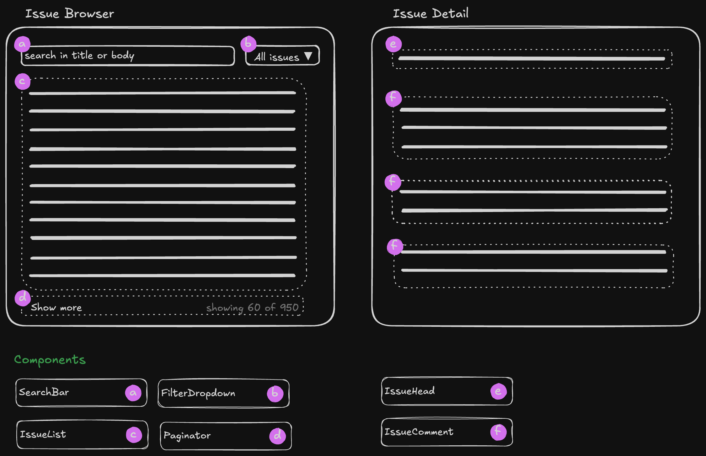

# GitHub GraphQL API example

This demo app is a frontend for the GitHub GraphQL API. The frontend allows you to browse the issues of a GitHub repository, specifically of the official React repository. It is a Next.js app which allows users to search for a text term in either the body or title of the issues as well as for the status OPEN or CLOSED. After listing these issues, the user can view a single issue and all the comments.

## Technologies used

- Typescript v5
- React.js v18
- Next.js v14, using the Pages Router
- Styled Components v6
- GraphQL v16
- ApolloClient v3
- Cypress v13

## Component overview


## Running and testing

Install dependencies
```
yarn
```

Run locally
```
yarn dev
```

E2E Testing with Cypress
```
yarn cy:open
```

